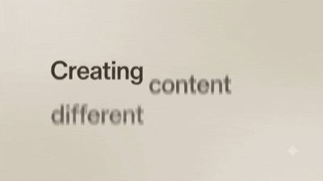

# 🚀 GloxPost

<p align="center">
  
</p>

<p align="center">
  <b>AI-powered content automation for creators.</b>
</p>

<p align="center">
  Turn one idea into platform-ready content with a single workflow.
</p>

---

## ✨ What is GloxPost?

**GloxPost** is an AI-powered content automation agent built with Python and OpenRouter.

Instead of manually creating content for every platform, you provide:

- 🎬 A YouTube/video title
- 📝 Context about the content

GloxPost then analyzes the content and automatically generates a complete content package.

```text
             ┌─────────────────┐
             │   TITLE +       │
             │   CONTEXT       │
             └────────┬────────┘
                      │
                      ▼
             ┌─────────────────┐
             │  AI ANALYZER    │
             └────────┬────────┘
                      │
                      ▼
             ┌─────────────────┐
             │ CONTENT GENERATOR│
             └────────┬────────┘
                      │
            ┌─────────┼─────────┐
            ▼         ▼         ▼
        YouTube   Instagram   Analysis
            │         │         │
            └─────────┼─────────┘
                      ▼
             ┌─────────────────┐
             │ TITLE EVALUATOR │
             └────────┬────────┘
                      │
                      ▼
             ┌─────────────────┐
             │ CONTENT REPORT  │
             └────────┬────────┘
                      │
                 ┌────┴────┐
                 ▼         ▼
               .TXT      .PDF
```

---

## ✨ Features

### 🎬 YouTube Title Generation

Generate **2 improved YouTube titles** based on the original idea and context.

Each title is evaluated around:

- Hook strength
- Curiosity
- Clarity
- Audience appeal
- Search potential

### 📊 AI Title Evaluation

GloxPost evaluates generated titles and provides scores for:

```text
Hook Strength
Curiosity
Clarity
Audience Appeal
Search Potential
Overall Score
```

The agent then selects the stronger title.

### ▶️ YouTube Descriptions

Automatically generates **2 structured YouTube descriptions** containing:

- 🚀 Video hook
- 📌 What's in the video
- 🔗 Useful links
- 💻 Project / GitHub
- 📱 Social links
- ⭐ Call to action
- #️⃣ Relevant hashtags

### 📱 Instagram Captions

Generate **2 Instagram-ready captions** with:

- Strong opening hooks
- Platform-appropriate formatting
- Calls to action
- Relevant hashtags
- Different caption styles

### 🧠 Content Analysis

Before generating content, GloxPost analyzes:

- Main topic
- Target audience
- Content category
- Viewer value
- Main hook
- Keywords
- Tone
- Curiosity opportunities
- Original title weaknesses

### 📄 Automatic Reports

GloxPost automatically creates a complete report containing:

```text
Original Input
Content Analysis
Generated YouTube Titles
Title Performance Analysis
Recommended Title
YouTube Descriptions
Instagram Captions
```

Reports are exported as:

```text
📄 TXT
📕 PDF
```

The filenames are automatically generated from the original title.

---

## 🏗️ Architecture

```text
main.py
   │
   ▼
workflow.py
   │
   ├── analyzer.py
   │      └── Content Analysis
   │
   ├── generator.py
   │      └── Content Generation
   │
   ├── evaluator.py
   │      └── Title Evaluation
   │
   └── formatter.py
          ├── TXT Report
          └── PDF Report
```

The AI prompts are maintained separately in:

```text
prompts.py
```

Configuration is handled through:

```text
config.py
.env
```

---

## 🛠️ Tech Stack

| Technology | Purpose |
|---|---|
| 🐍 Python | Core application |
| 🤖 OpenRouter | AI model access |
| 🧠 LLM | Content analysis & generation |
| 📄 ReportLab | PDF generation |
| 🔐 python-dotenv | Environment variables |
| 📦 JSON | Structured AI responses |

---

## 📁 Project Structure

```text
GloxPost/
│
├── main.py
├── workflow.py
├── analyzer.py
├── generator.py
├── evaluator.py
├── formatter.py
├── prompts.py
├── config.py
│
├── requirements.txt
├── .env.example
├── .gitignore
├── banner.gif
└── README.md
```

---

## ⚙️ Installation

### 1. Clone the repository

```bash
git clone https://github.com/YOUR_USERNAME/GloxPost.git
cd GloxPost
```

### 2. Install dependencies

```bash
pip install -r requirements.txt
```

### 3. Create your environment file

Create a file named:

```text
.env
```

Add:

```env
OPENROUTER_API_KEY=your_openrouter_api_key
MODEL_NAME=your_openrouter_model
```

> ⚠️ Never commit your `.env` file or expose your API key.

---

## 🚀 Running GloxPost

Run:

```bash
python main.py
```

GloxPost will ask for:

```text
YouTube Title:
Context:
```

Example:

```text
YouTube Title:
I Built an AI Agent With Python

Context:
A Python AI agent that automatically creates YouTube
and Instagram content from a single idea.
```

The workflow then runs automatically.

---

## 📤 Example Output

```text
2 YouTube Titles
        ↓
Title Performance Analysis
        ↓
Recommended Title
        ↓
2 YouTube Descriptions
        ↓
2 Instagram Captions
        ↓
Complete Content Report
        ↓
   ┌──────────┐
   │ TXT + PDF│
   └──────────┘
```

---

## 🔐 Environment Variables

Create `.env`:

```env
OPENROUTER_API_KEY=your_api_key
MODEL_NAME=your_model
```

A template is provided in:

```text
.env.example
```

The real `.env` file is intentionally excluded from Git using `.gitignore`.

---

## 💡 Why GloxPost?

Creating content isn't only about making the actual video.

Creators often have to repeatedly:

- Rewrite titles
- Create descriptions
- Adapt content for Instagram
- Research keywords
- Compare title ideas
- Format descriptions
- Organize their content

GloxPost turns these repetitive tasks into **one automated workflow**.

### One idea.

### Multiple platforms.

### One AI workflow.

---

## 🔮 Future Improvements

Potential future extensions include:

- 📅 Content scheduling
- 📈 Analytics-based title optimization
- 🖼️ AI thumbnail generation
- 🎬 Short-form video generation
- 🧵 X / Twitter content
- 💼 LinkedIn posts
- 📱 TikTok captions
- 🔄 Automated publishing
- 📊 Performance feedback loops

---

## 🏆 Built For

GloxPost was built for the **Social Media Automation Hackathon**.

The goal is simple:

> **Automate repetitive creator work so creators can spend more time creating.**

---

# 🙏 Credits

**GloxPost** was designed and developed by **Gaurav Wadhwani**.

Built with:

- 🐍 Python
- 🤖 OpenRouter
- 📄 ReportLab
- 💡 Open-source technologies

Special thanks to the developers and communities behind the tools and libraries that make this project possible.

---

> [!WARNING]
> ## ⚠️ Disclaimer
>
> GloxPost is provided for **educational and demonstration purposes**.
>
> This project is intended to help developers learn about:
>
> - AI agents and workflows
> - OpenRouter integration
> - Python project architecture
> - Content automation
> - LLM-powered content generation
> - Automated report generation
>
> **Please do not present, re-upload, or submit this project as your own work without proper permission and attribution.**
>
> If you use, modify, or build upon GloxPost, please respect the project's license and give appropriate credit to the original creator.
---

### ❤️ Made by Gaurav W | Avg Lucer

**🚀 GloxPost — Create once. Publish everywhere.**
